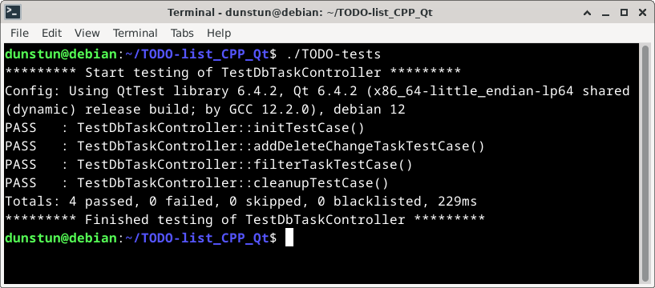

# TODO List Application with Qt

**(ТУТ БУДЕТ GIF)**

---

## Содержание

1. [Идея проекта](#идея-проекта)
2. [Установка](#установка)
3. [Тестирование](#тестирование)
4. [Удаление задач из БД](#удаление-задач-из-бд)
5. [Планы по доработке](#планы-по-доработке)

---

### Идея проекта
Необходимо реализовать небольшое приложение TODO-list с использованием Qt6. Пользователь должен иметь возможность добавлять/удалять задачи, менять их статус и фильтровать. Полное описание задачи доступно [**тут**](TASK.md).

Для того, чтобы задачи не удалялись с закрытием приложения, я добавляю их в базу данных PostgreSQL.

Из других особенностей:
- Сортировка задач.
- Установка флажков "В работе", "На паузе" и "Выполнено"
- Подсветка задач, в том числе просроченных


### Установка
Разработка велась на Debian 12 с использованием только стандартных пакетов.

Вам потребуется установить PostgreSQL, Qt6, CMake, Make
```bash
sudo apt install g++ make cmake postgresql qt6-base-dev libqt6sql6-psql clang-format
```
Команда `clang-format` автоматически вызывается первой при каждой сборке проекта. Её можно отключить, удалив строки 44-50 и 54 из [CMakeLists.txt](CMakeLists.txt)

Затем нужно подготовить БД для работы (иначе программа будет завершаться с ошибкой):
```bash
bash init_db.sh
```
И затем собрать проект с помощью Makefile, который уже запускает cmake:
```bash
make
```
Запускать приложение нужно из корневой папки проекта:
```bash
./TODO-list
```

---

### Тестирование
- Есть возможность собрать приложение с санитайзерами `-fsanitize=address -fsanitize=leak -fsanitize=undefined` :
```bash
make debug
```
Создаётся программа с тем же именем - `TODO-list` 

<br>

- Для проекта (а именно для его части, которая отвечает за взаимодействие с БД, фильтрацией и сортировкой задач - **DbTaskController**) написаны тесты с использованием **QtTest**. Тесты находятся в папке [tests](tests). Сборка и запуск тестов:

```bash
make tests && ./TODO-tests
```

Вывод:



---

### Удаление задач из БД
Все объекты базы данных, используемые в приложении, можно удалить следующей командой:
```bash
bash clear_db.sh
```

---

### Планы по доработке
Что можно добавить и что улучшить?
- Написать больше тестов.
- Проработать фильтрацию и сортировку задач. Текущий алгоритм не кажется самым эффективным (особенно сортировки, когда приисходит полное удаление и создание задач при каждой операции).
- Добавить перевод на другие языки.